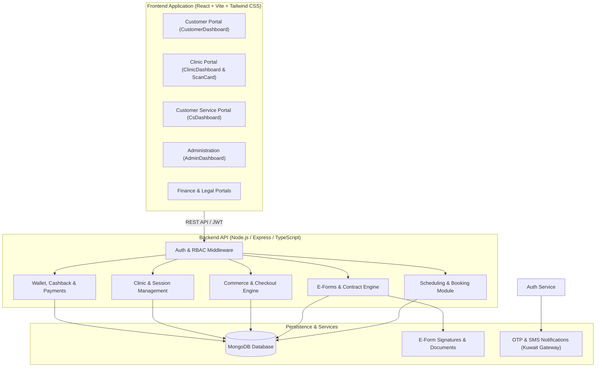
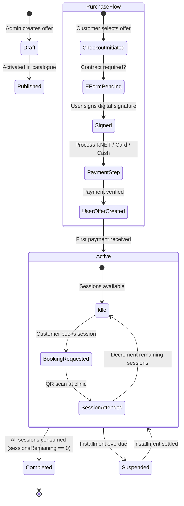
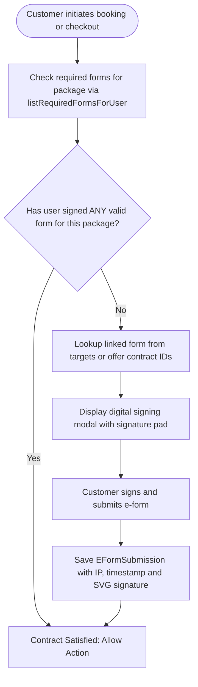
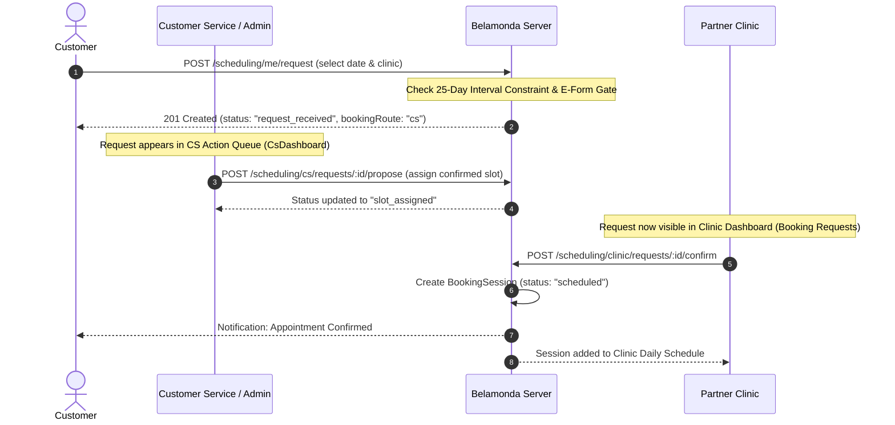
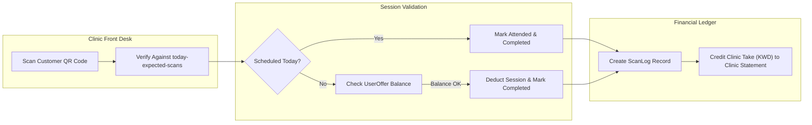
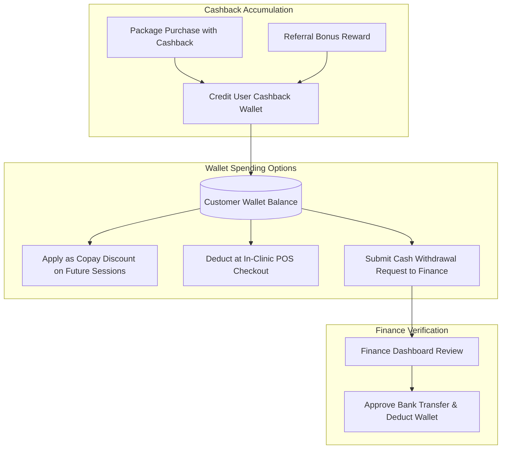

# Belamonda Platform — Complete System Logic & Architecture Manual
> **Comprehensive Technical & Business Domain Reference Guide**  
> *Version: 2.4 | Environment: Production / Node.js + Express + TypeScript + React + MongoDB*

---

## Table of Contents
1. [Executive Summary & Tech Stack](#1-executive-summary--tech-stack)
2. [User Roles & Authorization Matrix (RBAC)](#2-user-roles--authorization-matrix-rbac)
3. [Core Domain Models & Database Schemas](#3-core-domain-models--database-schemas)
4. [Commercial Offers & Membership Lifecycle](#4-commercial-offers--membership-lifecycle)
5. [Legal Contracts & E-Forms Logic](#5-legal-contracts--e-forms-logic)
6. [Booking & Scheduling State Machine](#6-booking--scheduling-state-machine)
7. [Clinic Workflow & QR Attendance System](#7-clinic-workflow--qr-attendance-system)
8. [Wallet, Cashback & Payments Processing](#8-wallet-cashback--payments-processing)
9. [Customer Service & Admin Operations](#9-customer-service--admin-operations)
10. [Audit Logging, Safety Rules & Error Codes](#10-audit-logging-safety-rules--error-codes)

---

## 1. Executive Summary & Tech Stack

**Belamonda** is a dual-language (Arabic/English) multi-tenant health, beauty, and laser clinic membership platform operating in Kuwait. It manages customer subscriptions, installment billing, electronic legal contracts, booking dispatch between call centers and partner clinics, and in-clinic QR attendance validation.

### Architecture Overview



### Technology Matrix
* **Frontend**: React 18, Vite, TypeScript, Tailwind CSS, Lucide icons, i18next (Arabic RTL default with instant English LTR toggle).
* **Backend**: Express.js, TypeScript, Mongoose (MongoDB ODM), Zod schema validations, JWT authentication.
* **Shared Layer**: `@belamonda/shared` containing unified TypeScript interfaces, enums, and calculation helpers.
* **Database**: MongoDB with collections for users, offers, user-offers, booking requests, sessions, e-forms, wallet transactions, and audit trails.

---

## 2. User Roles & Authorization Matrix (RBAC)

The system enforces strict role-based access control through the `authRequired` and `requireRole` middleware.

| Role | Target Portal | Core Permissions & Responsibilities |
| :--- | :--- | :--- |
| `customer` | `CustomerDashboard` | Browse packages, buy memberships, sign e-forms, request bookings, view QR pass, track cashback. |
| `clinicStaff` | `ClinicDashboard` | Daily schedule, QR scanner, mark session attendance/no-show, review forwarded booking requests, manage missed sessions. Restricted strictly to their assigned `clinicId`. |
| `cs` / `cs_director` | `CsDashboard` | Review customer booking requests, assign clinic slots, propose dates, handle clinic transfers, communicate via booking chats. |
| `legal` | `CsDashboard` / Legal Views | E-form approvals, KYC compliance, customer dispute audits. |
| `finance` | `FinanceDashboard` | Review offline bank transfers, approve cashback withdrawals, reconcile clinic session fees and gross revenue. |
| `admin` | `AdminDashboard` | Unrestricted superuser access: create/edit offers, modify clinic pricing, manual e-form assignment, system settings, override interval gates. |

---

## 3. Core Domain Models & Database Schemas

### 1. User (`UserModel` / `users`)
Represents customers, administrators, and staff.
* Key fields: `phone` (unique Kuwaiti phone), `fullName`, `role`, `clinicId` (for clinic staff), `civilId`, `walletBalanceKwd`, `referralCode`, `isActive` (account enabled/disabled).

### 2. Offer (`OfferModel` / `offers`)
The commercial product definition.
* `pricingMode`: `"full"`, `"installments"`, `"deposit"`, `"pay_per_session"`, `"cashback"`.
* `totalSessions`: Total session allowance (e.g. 4, 8, 12).
* `bookingFlow`:
  * `"admin_forward"`: Customer booking requests land in Customer Service queue for dispatch.
  * `"direct_clinic"`: Customer booking requests go straight to the partner clinic.
* `clinics`: Eligible partner clinic IDs.
* `fullPaymentEFormId`, `installmentsEFormId`, `depositEFormId`: Linked mandatory legal contracts.

### 3. UserOffer (`UserOfferModel` / `useroffers`)
A customer's acquired membership instance.
* `status`: `"pending"` (awaiting initial contract/payment), `"active"` (in good standing), `"paused"`, `"completed"` (all sessions consumed), `"cancelled"`.
* `sessionsCompleted`, `sessionsRemaining`: Session counters.
* `paidInstallmentsCount`: Counter for tracking installment schedules.
* `nextInstallmentDueDate`: Cutoff date for the next installment.
* `isFrozen`: Temporary freeze flag preventing appointment bookings.

### 4. BookingRequest (`BookingRequestModel` / `bookingrequests`)
A customer's appointment reservation ticket.
* `bookingRoute`: `"cs"` (managed by Customer Service) or `"clinic"` (direct to clinic).
* `status`: `"request_received"` -> `"slot_assigned"` / `"slot_proposed"` -> `"scheduled"` -> `"completed"` / `"cancelled"`.
* `proposedAt`, `preferredAt`, `clinicScheduledAt`: Temporal targets for scheduling.
* `scheduledSessionId`: Reference to the finalized execution session (`BookingSession`).

### 5. BookingSession (`BookingSessionModel` / `bookingsessions`)
The actual calendar entry executed at a clinic.
* `scheduledAt`: Final confirmed ISO timestamp.
* `status`: `"scheduled"`, `"completed"`, `"no_show"`, `"cancelled"`.
* `scannedAt`, `scannedBy`: QR attendance log tracking.

---

## 4. Commercial Offers & Membership Lifecycle



### Installment Protection Engine
When a customer purchases an installment package:
1. **First Payment**: Unlocks the first session(s).
2. **Next Session Lock**: Before booking session $N+1$, the system validates `paidInstallmentsCount >= requiredInstallments`. If overdue, booking is rejected with error `INSTALLMENT_NOT_PAID_FOR_NEXT_SESSION`.
3. **Grace Period**: Configurable grace days before freezing active privileges.

---

## 5. Legal Contracts & E-Forms Logic

Contracts are mandatory electronic agreements governing medical consent, installment obligations, and cancellation penalties.



### Strict Golden Rules of the E-Form Engine
1. **One Contract Per Package**: A customer is never asked to sign more than one contract for the same package. Once signed, all subsequent sessions under that package are permanently unlocked.
2. **Deduplication Gate**: `listRequiredFormsForUser()` checks existing `EFormSubmissionModel` entries before returning requirements. If a valid submission exists for the package/target, the required list is empty (`[]`).
3. **Manual Admin Assignment Guard**: Admins cannot accidentally re-assign a contract to a customer who has already signed one (`ALREADY_SIGNED` error).

---

## 6. Booking & Scheduling State Machine

The scheduling system is the central nervous system connecting customers, customer service, and partner clinics.



### 1. The 25-Day Medical Interval Rule
* Medical standard: Laser sessions must have at least **25 days of spacing** between consecutive appointments.
* **Automatic Enforcement**: When a booking is attempted within $< 25$ days of the customer's last completed session, the API halts and returns:
  ```json
  { "error": "INTERVAL_WARNING", "daysSinceLastSession": 18, "minDaysRequired": 25 }
  ```
* **Staff Override**: Only authorized staff (`admin`, `cs`, `clinicStaff`) can override this constraint by providing `forceOverride: true` with an audit confirmation. Customers cannot bypass this restriction.

### 2. Isolation Between Customer Service and Clinic Dashboard
* **New Customer Requests**: Start in `status: "request_received"`. These are strictly internal to Customer Service / Admin.
* **Forwarding Barrier**: The clinic dashboard's `/clinic/requests` endpoint filters out `request_received` so clinics **never see** unreviewed bookings.
* **Missed Sessions Safety**: The `/clinic/:clinicId/missed-sessions` endpoint strictly queries past scheduled appointments (`BookingSession`) and excludes unforwarded requests (`request_received`), preventing fresh requests from ever showing up as "Missed Sessions".

---

## 7. Clinic Workflow & QR Attendance System

Partner clinics operate with high efficiency through the simplified **Clinic Dashboard** and **ScanCard** interface.



### Daily Operational Features
1. **Today's Expected Customers (`/today-expected-scans`)**: Automatically joins scheduled calendar sessions with real-time scan logs, showing which customers have arrived vs. awaiting scan.
2. **One-Tap Attendance Marking**: Clinic marks customer as "Completed" or "No Show". Completed sessions instantly deduct from the user's membership balance.
3. **No-Show Handling**: Automatically moves the session to the **Missed Sessions** queue, allowing the clinic or customer service to reschedule or cancel.
4. **POS Bill Reconciliation**: If a cash copay or extra product purchase is required at the clinic, staff marks it as `paid` directly from the dashboard.

---

## 8. Wallet, Cashback & Payments Processing



### Payment Mechanics
* **KNET / Credit Card**: Handled via payment gateway integration. Successful webhooks transition `Payment` records to `"completed"` and generate automated digital invoices.
* **Cash at Clinic**: Clinic collects physical cash and marks `clinicPaymentStatus = "paid"`. System tracks the split between the clinic's fee and Belamonda's commission.
* **Offline Bank Transfer**: Customer uploads receipt. Marked `"pending_review"` until verified by `finance` or `admin`.

---

## 9. Customer Service & Admin Operations

### Customer Service Operations (`CsDashboard`)
1. **Action Queues**:
   * **Booking Requests Queue**: Central inbox for incoming customer requests. Allows proposing dates, assigning clinics, or rejecting invalid requests.
   * **Clinic Transfer Modal**: Allows moving a customer's request or entire membership to a different partner clinic with an optional administrative transfer fee (e.g. 5.000 KWD or 10.000 KWD).
   * **KYC & Contract Audits**: Verifying customer identity documents and signed agreements.
2. **Booking Chat Threads**: Every booking request automatically spawns a real-time messaging conversation (`ensureConversationFor`) connecting the customer, CS representatives, and assigned clinic staff.

### Administrative Control (`AdminDashboard`)
* **Offer Builder**: Full configuration of session allowances, pricing modes, installment breakdowns, and mandatory contract bindings.
* **Clinic Management**: Setting clinic service capabilities, doctor schedules, operating hours, and commission splits.
* **Safety Freezing (`isActive: false`)**: Instantly freezes fraudulent or non-paying customer accounts across the entire platform.

---

## 10. Audit Logging, Safety Rules & Error Codes

### Standard API Error Codes Reference
| Error Code | HTTP Status | Meaning & Cause |
| :--- | :--- | :--- |
| `INTERVAL_WARNING` | `409` | Appointment date is $< 25$ days from previous completed session. Requires staff override. |
| `EFORMS_REQUIRED` | `403` | User must sign the mandatory package contract before booking or completing checkout. |
| `INSTALLMENT_NOT_PAID_FOR_NEXT_SESSION` | `409` | Next package installment is due and must be settled before booking another session. |
| `MAX_SESSIONS_REACHED` | `409` | All package sessions have been consumed (`sessionsRemaining === 0`). |
| `SLOT_TAKEN` | `409` | Selected appointment time slot at the clinic is already booked. |
| `ALREADY_SIGNED` | `400` | Attempted to assign a contract that the customer has already executed. |
| `USER_OFFER_NOT_FOUND` | `404` | Membership instance does not exist or user lacks ownership/group rights. |
| `FORBIDDEN_CLINIC` | `403` | Clinic staff attempted an action on a clinic outside their assigned authorization. |

### Audit Logging
All critical mutations (overriding interval rules, deleting completed sessions, transferring clinics, manual contract assignments, financial status changes) are recorded in the `auditlogs` collection with:
* `actorId`, `actorRole`, `ipAddress`
* `action` (e.g. `OVERRIDE_INTERVAL`, `CLEANUP_DUPLICATE_EFORMS`, `TRANSFER_CLINIC`)
* `before` and `after` change snapshots for complete regulatory and internal traceability.
